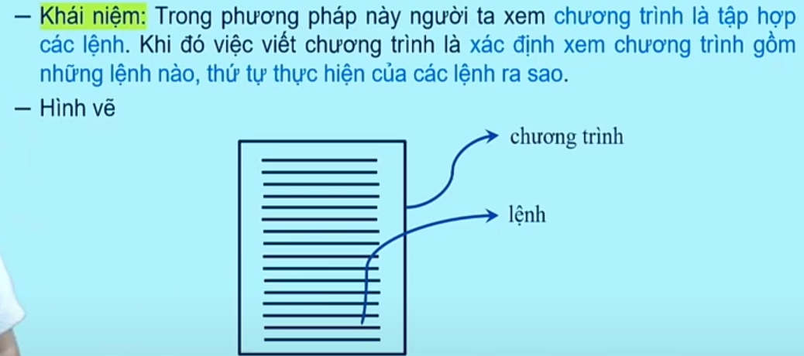
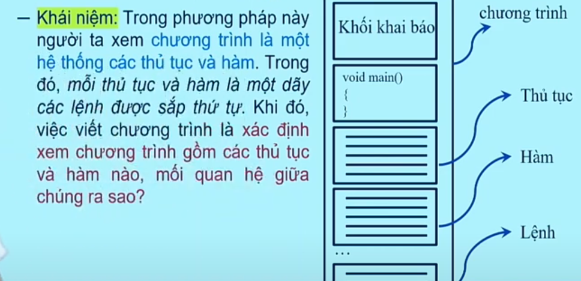
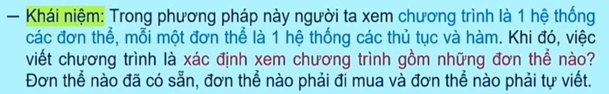
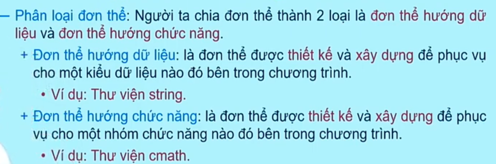
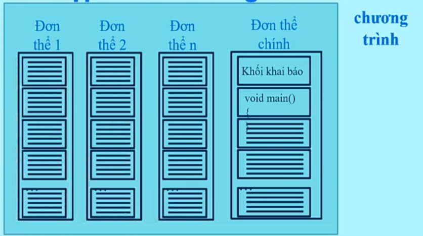
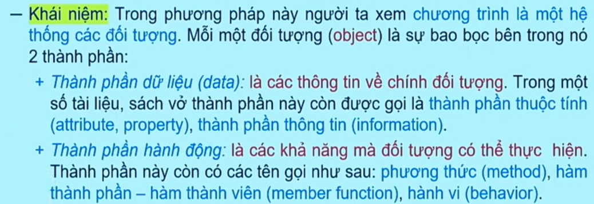
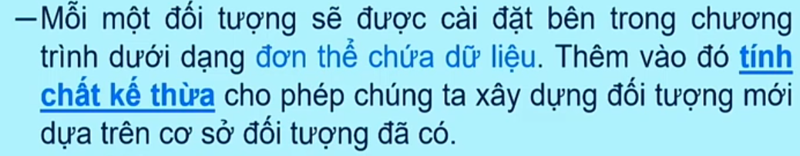

# Các phương pháp lập trình

## 1. Phương pháp lập trình hướng lệnh

## 2. Phương pháp lập trình hướng thủ tục và hàm

## 3. Phương pháp lập trình hướng đơn thể

## 4. Phương pháp lập trình hướng đối tượng
