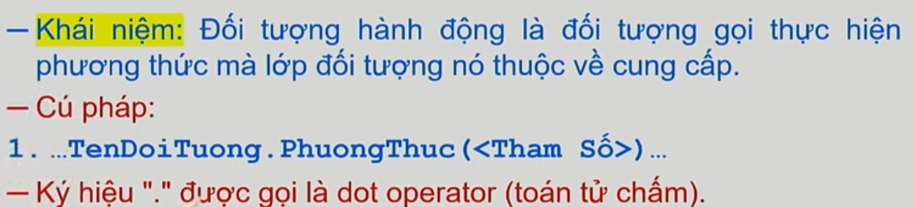

# Lập trình hướng đối tượng với C++

## Lớp đối tượng (Class)

## Đối tượng (Object)

## Phương thức (Method)

## Đối tượng hành động

# Bài tập

### Chương trình đầu tiên: Viết chương trình nhập họ tên, điểm toán, điểm văn của một học sinh. Tính điểm trung bình và xuất kết quả.
### Ứng dụng 1: Viết chương trình nhập vào một phân số. Rút gọn phân số đó và xuất kết quả.
### Ứng dụng 2: Viết chương trình nhập vào tọa độ 2 điểm trong mặt phẳng Oxy. Tính khoảng cách giữa chúng và xuất kết quả.
