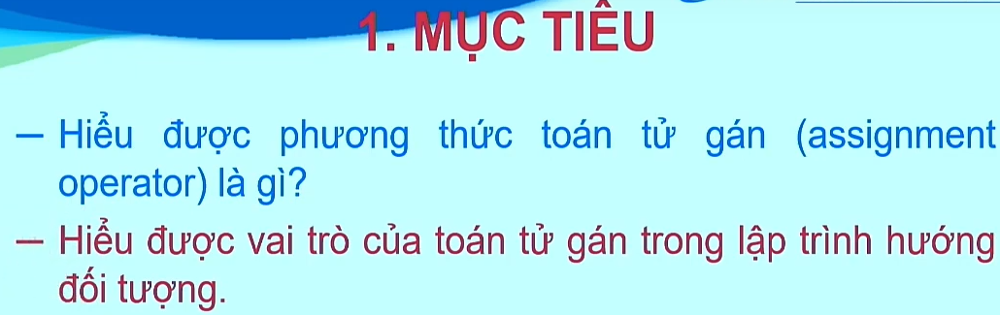
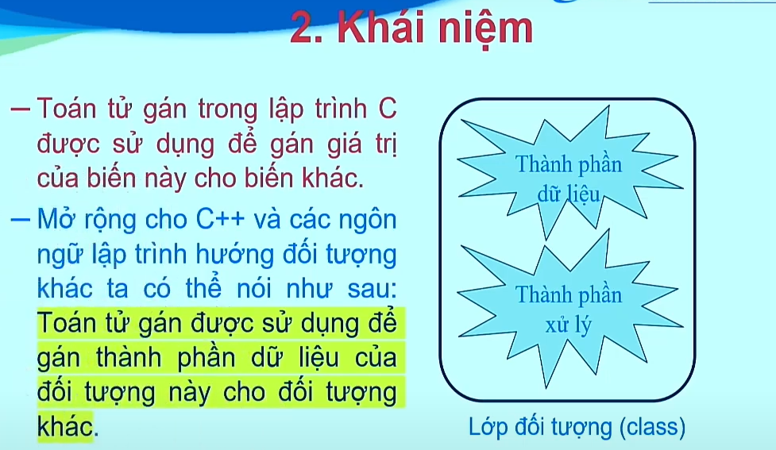
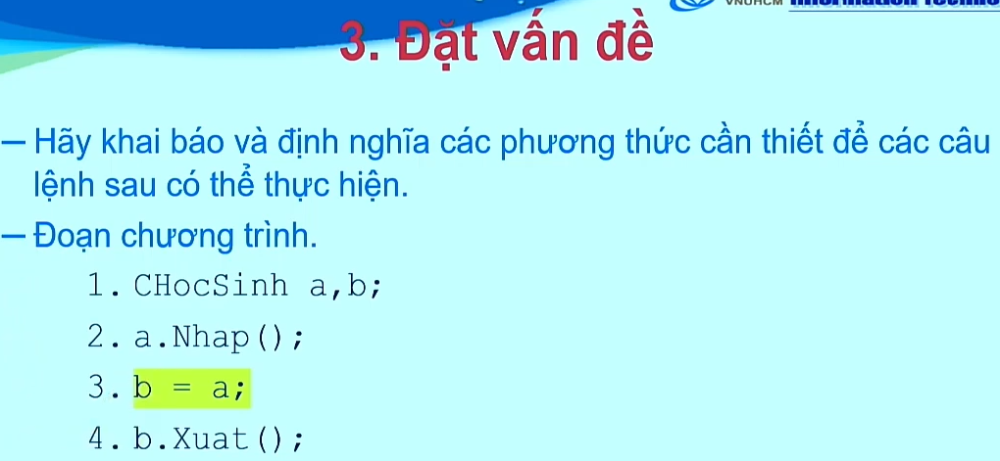
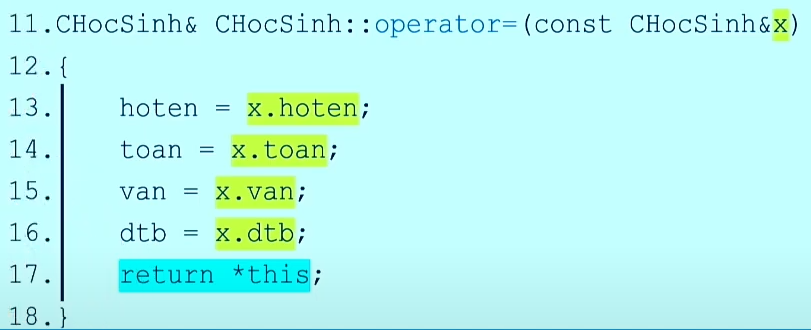

# TOÁN TỬ GÁN (OPERATOR = )

### Ghi chú quan trọng
- Toán tử gán được cài đặt bên trong lớp CHocSinh như là phương thức của lớp.
- Miền giá trị của **biến con trỏ** là đại chỉ ô nhớ.
- Bên trong thân của một phương thức, this là một con trỏ đối tượng thuộc về lớp mà phương thức đó thuộc về.
- Bên trong thân của một phương thức của một lớp, this là một con trỏ đối tượng đang gọi thực hiện phương thức.
- Bên trong thân phương thức của một lớp, this là một con trỏ đối tượng giữ địa chỉ của đối tượng đang gọi thực hiện phương thức. Hơn nữa, *this chính là đối tượng đang gọi thực hiện phương thức.
